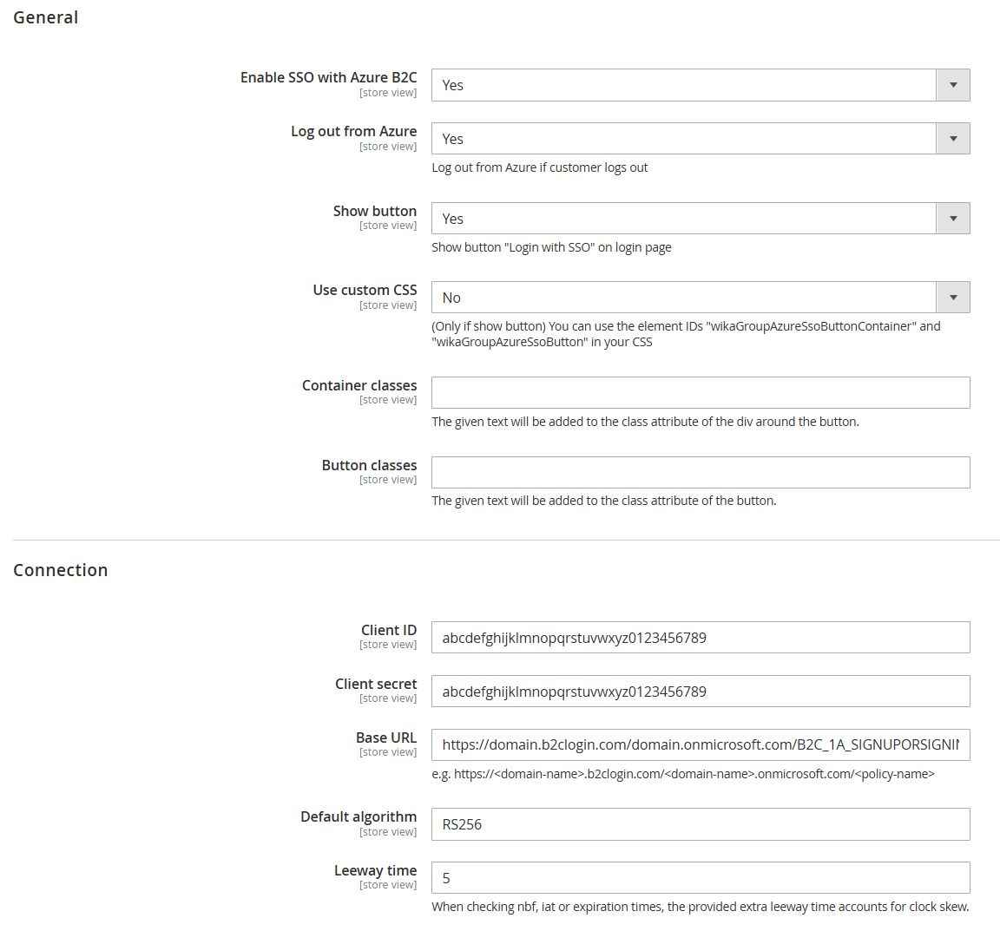

# Mage2 Module WIKA Azure B2C

Magento2 Module to add support for a login via Azure B2C

> **Important:** Ensure that the email address is delivered in the Azure B2C response.

## Configuration
The configuration can be found in the admin backend under:  
`Stores` -> `Settings` -> `Configuration` -> `WIKA GROUP` -> `Azure B2C`

If you do not want to use the provided button, you can disable it with the "Show button" setting.  
To trigger the redirect to Azure for the login, call the route `<your-domain>/azureb2c/login/authorize`.  
The response will be processed from the controller `<your-domain>/azureb2c/login/callback`.



## Autologin after registration in B2C
The first time a customer is registrating on the shop, the redirect after the registration takes them back to the shop.
But the shop doesn't know that the user is logged in.
For this scenario, a GET parameter can be used to automatically redirect the user to the login again.
As the customer is already logged in in B2C, no input is required and a redirect will lead back to the shop, but now the customer will also be logged in to the shop.


## Events

### customer_login
Observers for the event `customer_login` will be triggered if a customer uses Azure B2C to login.

### azure_b2c_sso_[create|update]_customer_after
The extensions triggers an event after a new customer was created and after a customer has been updated.

The event `azure_b2c_sso_create_customer_after` is triggered after this module created a new magento customer.

The event `azure_b2c_sso_update_customer_after` is triggered after this module updated a magento customer. The update also happends after a customer was created.

[More details in official documentation](https://developer.adobe.com/commerce/php/development/components/events-and-observers/)

**Usage of the events**  
<vendor_name>/<module_name>/etc/events.xml
```xml
<?xml version="1.0"?>
<config xmlns:xsi="http://www.w3.org/2001/XMLSchema-instance" xsi:noNamespaceSchemaLocation="urn:magento:framework:Event/etc/events.xsd">
    <event name="azure_b2c_sso_create_customer_after">
        <observer name="<vendor_name>_sso_create_customer_after" instance="<vendor_name>\<module_name>\Observer\SsoCreatedCustomer"/>
    </event>
    <event name="azure_b2c_sso_update_customer_after">
        <observer name="<vendor_name>_sso_update_customer_after" instance="<vendor_name>\<module_name>\Observer\SsoUpdatedCustomer"/>
    </event>
</config>
```

<vendor_name>\<module_name>\Observer\SsoCreatedCustomer.php or <vendor_name>\<module_name>\Observer\SsoUpdatedCustomer.php
```php
<?php

namespace <vendor_name>\<module_name>\Observer;

use Magento\Framework\Event\ObserverInterface;

class SsoCreatedCustomer implements ObserverInterface
{
    public function execute(\Magento\Framework\Event\Observer $observer)
    {
        $userData = $observer->getData('user_data');
        // Do some work with that data...
        $familyName = $userData['family_name'];
    }
}
```
